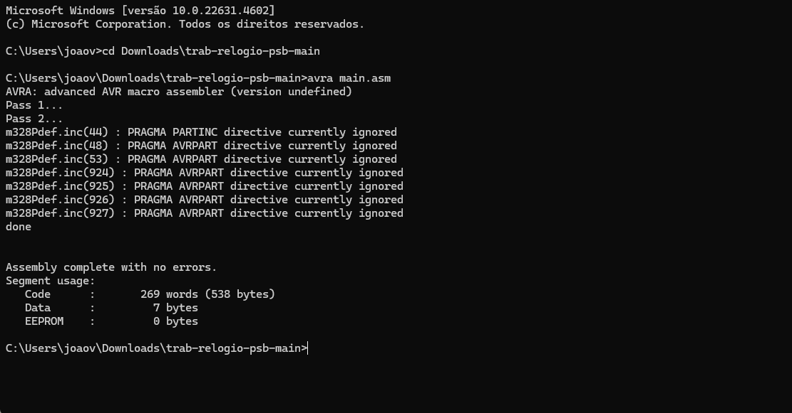

Relógio de Psb

## Pre-requisitos
* SimuliIDE
* AVRA Compiler

# Como usar?

## 1 - Clone ou baixe o repositório

## 2 - Extraia os arquivos 

## 3 - Compile o código
No terminal, navegue até a pasta que você extraiu e execute o comando
```cmd
...\trab-relogio-psb-main> avra main.asm
```
para compilçar

## Carregue o circuito
Abra seu programa SimuliIDE e clique em Abrir circuito (CTRL + O)

Navegue até a pasta que você extraiu e selecione o arquivo `CIRCUIT.sim1`

Clique com o botão direito do mouse sobre o microcontrolador ATMega328 e clique em "Carregar firmware"

Navegue até a pasta onde extraiu e selecione o arquivo "main.hex" gerado pelo compilar AVRA

Clique no botão "Start Simulation" para iniciar a simulação e ligar o relógio.


## Use o relógio
* O botão mais abaixo alterna a visualização entre horas:minutos e minutos:segundos

---
O botão mais acima alterna do modo relógio (contagem crescente) para temporizador (contagem decrescente) e vice-versa
